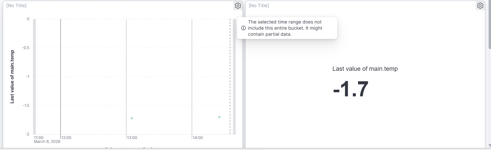
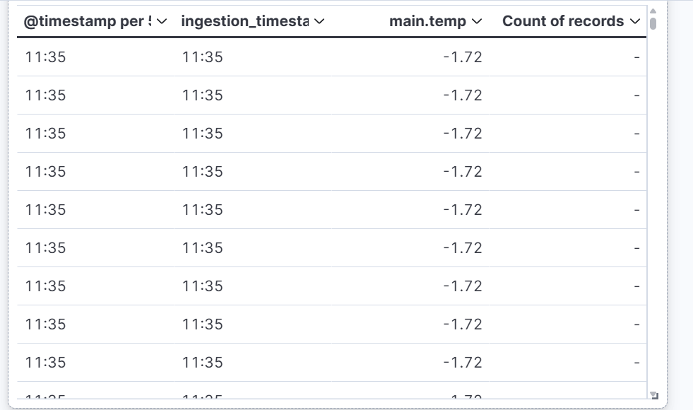

Weather Monitoring Pipeline (Mestia, Georgia)
Project Overview
This project implements a high-precision data pipeline for real-time weather monitoring. It captures meteorological data from the OpenWeatherMap API, processes it through a distributed message broker, and visualizes the results with millisecond accuracy in an ELK Stack dashboard.

Tech Stack
Source Data: OpenWeatherMap API (Mestia, Georgia).

Producer: Python script handling API requests and initial data formatting.

Message Broker: RabbitMQ for asynchronous and reliable data queuing.

ETL & Ingestion: Logstash for data transformation and precise timestamp mapping.

Storage & Search: Elasticsearch for indexing high-resolution time-series data.

Visualization: Kibana SRE Dashboard.

Orchestration: Fully containerized using Docker Compose.

Key Technical Achievements
1. High-Precision Timestamp Ingestion (Sub-Second Accuracy)
A critical requirement was maintaining millisecond precision from the source to the dashboard.

Implementation: The Python producer captures a high-resolution timestamp at the moment of the API call.

Data Integrity: Logstash is configured to preserve this precision, mapping it to the ingestion_timestamp field.

Verification: As seen in the Discover view, the system successfully indexes data with 3-digit millisecond accuracy (e.g., .392).

2. Operational SRE Dashboard
The Kibana dashboard provides immediate situational awareness:

Real-time Metric: A "Last Value" metric displays the current temperature with float-level precision (e.g., -1.72°C).

Trend Monitoring: A line chart tracks temperature fluctuations over time, ensuring historical visibility.

Raw Data Audit: A data table provides a direct view of the raw logs, serving as an audit trail for data validation.

Deployment
Ensure Docker Desktop is running.

Clone this repository.

Run docker-compose up -d to spin up the full stack.

Open Kibana at http://localhost:5601 and navigate to the "Weather Monitoring" dashboard.